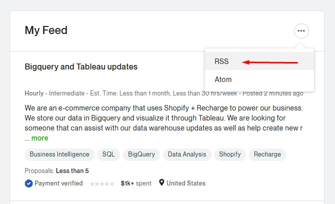
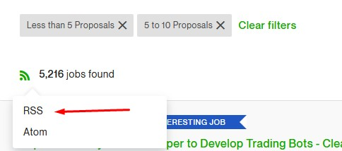
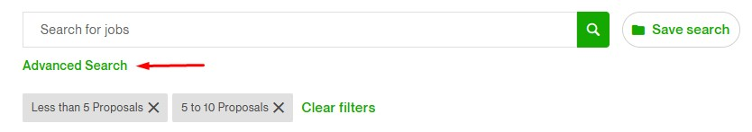

# Upwork Job Delivery Bot #

## What does it do? ##
I often found it tedious and a huge time sink to keep refreshing Upwork's feed to find jobs.

So I implemented this custom solution to deliver my RSS feed to me on telegram while I'm busy with other things!

The idea is adding your RSS feeds to the bot on telegram, and in one place you'll start getting your job feeds delivered to your phone/pc.

## How to get started using the bot on Telegram? ##

Saerch for the bot on Telegram `@UpworkDeliveryBot` and follow the starting tutorial.

## Where do I get my RSS urls? ##
On your main feed:



From search:



I highly suggest using advanced search before using the RSS url since RSS feed keeps track of your filters as well as keywords.



## How do I get set up to run the bot myself? ##
Create and activate a virtualenv:

```shell
$ cd upwork-telegram-bot
$ python3.9 -m venv venv
$ source venv/bin/activate
```

Install the dependencies:
```shell
(venv)$ pip install -r requirements
```

Create your `.env` file with this format:
```
TOKEN=YOUR_TELEGRAM_BOT_TOKEN
DB_CONNECTION=MONGO_DB_CONNECTION_STRING
DB_NAME=MONGO_DB_NAME
DEVS=COMMAN_SEPARATED_STRING_OF_DEVS_ID (Chat ID between you and the bot)
```

Run the bot:
```shell
(venv)$ python bot.py
```

And you're good to go!

## Disclaimer ##

Upwork is a registered trademark of Upwork Inc.

The contributions of this bot isn't in anyway affiliated with, sponsored by, or endorsed by Upwork Inc.

The contributors of this bot are not responisble for end users' actions.